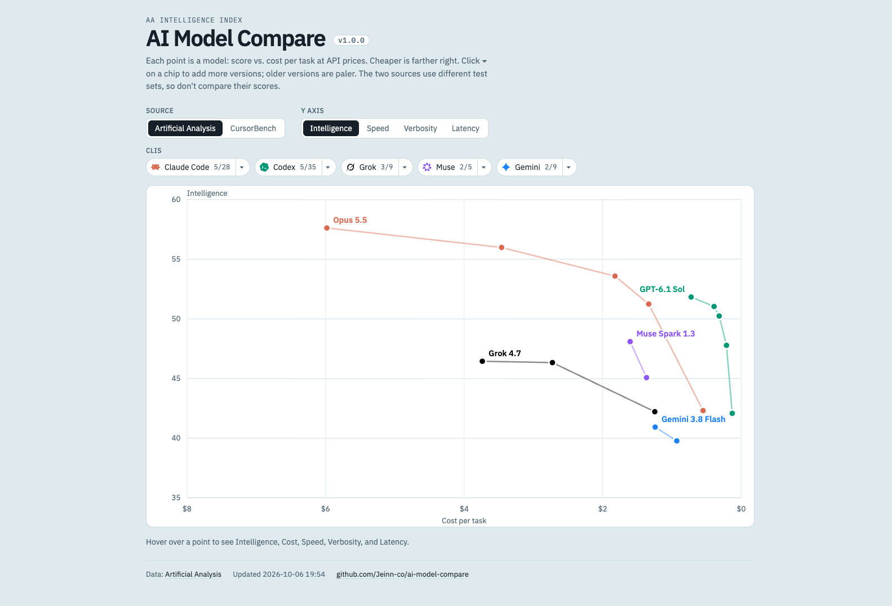
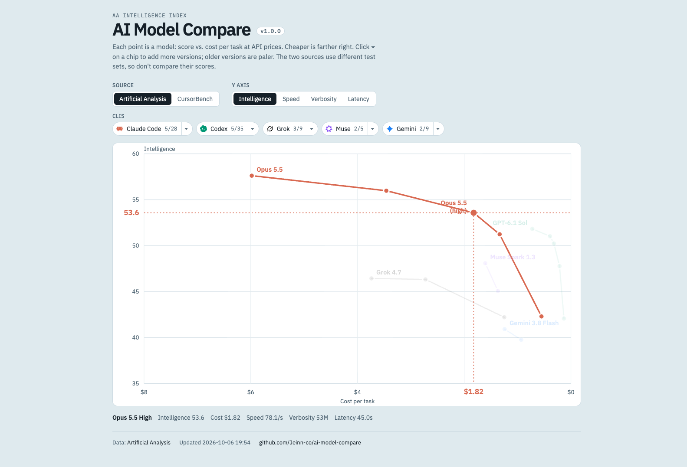
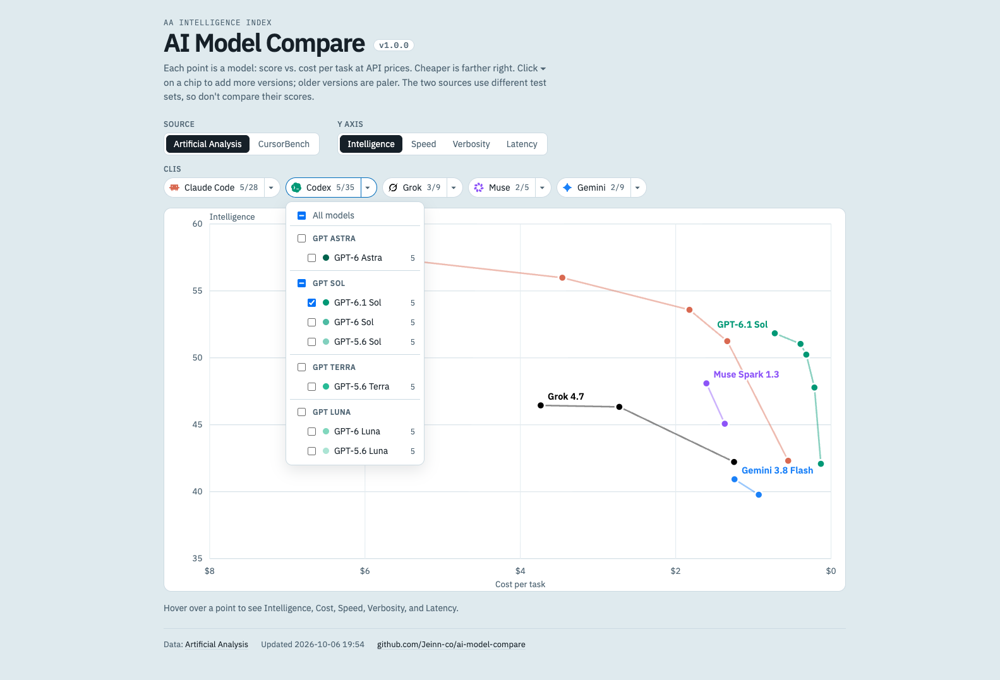
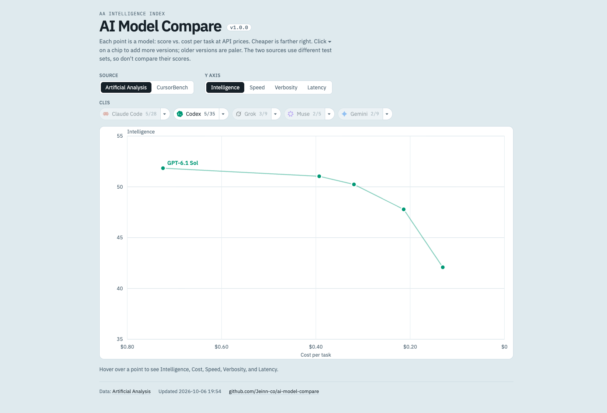
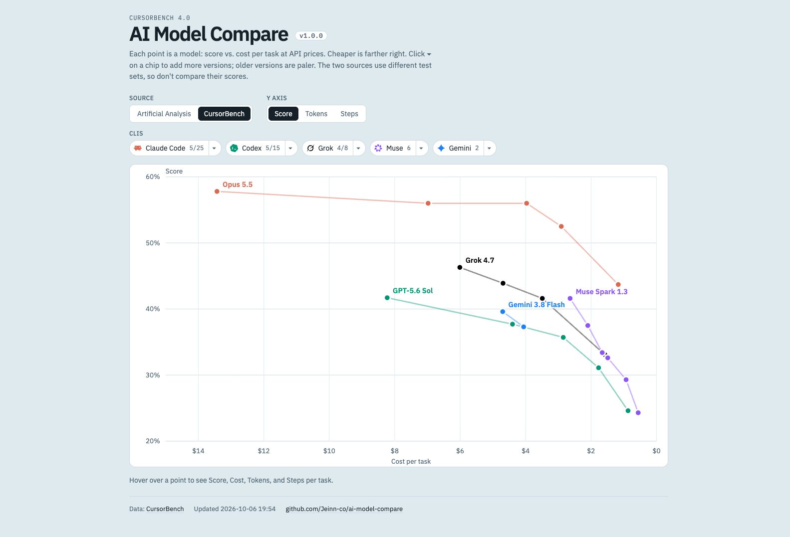

# AI Model Compare

A small local viewer that plots **score vs. cost per task** for coding AI models, including DeepSeek and GLM, from the [Artificial Analysis](https://artificialanalysis.ai/models/releases) Intelligence Index (the default) or the [CursorBench](https://cursor.com/cursorbench) leaderboard, so you can see at a glance which model and effort level gives the most score per dollar. Cost is per task at API prices, not a subscription.

**Live:** https://jeinn-co.github.io/ai-model-compare/ (both sources checked every six hours; data published only when it changes)

| Provider    | Lines in the ▾ menu (every listed version of each)        |
| ----------- | --------------------------------------------------------- |
| Claude Code | Fable, Opus, Sonnet, Haiku                                |
| Codex       | GPT Astra, Sol, Terra, Luna                               |
| Grok        | Grok, Grok Build                                          |
| Muse        | Muse Spark, Muse Glimmer                                  |
| Gemini      | Gemini Argon, Flash, Flash-Lite, Pro                      |
| DeepSeek    | Flash, Pro, Flash Vision                                 |
| GLM         | GLM, Flash, Turbo, Vision Turbo                           |
| Cursor      | Composer                                                 |

Every effort level the source lists (Minimal → Max) appears as its own point, and each model's points are connected into one line.

DeepSeek and GLM have their own legend chips and model menus. Their defaults follow the newest DeepSeek Flash and base GLM release the source lists. A provider only appears on a source that has scored, costed rows for it: DeepSeek currently appears on Artificial Analysis, while GLM appears on both sources.

Cursor's Composer models have their own chip on CursorBench, with the newest listed version checked by default.

**Selection policy:** Keep recognizable model families with ongoing developer discussion. A benchmark listing alone is not a reason to add a family. Review new families before adding them to the supported list; do not automatically expand to every model a source lists. Scores and costs compare the selected models, not their popularity.

The page opens on Artificial Analysis, with one model checked per provider: the newest version the source lists of Opus, GPT Sol, Grok, Muse Spark, Gemini Flash, DeepSeek Flash, base GLM and Composer. When a newer version shows up, such as Opus 5.6, it is checked in place of the old one with no code change. A provider that has none of these lines on a source gets the first model of its menu instead. Every other supported model the source lists, every version of every line, is in the ▾ menu to tick. On Artificial Analysis only releases from roughly the last eight months are drawn, and a model AA scored without a cost per task (for example Opus 4.7 or Grok 4.20) cannot be placed on the cost axis and is left out.



Hovering a point spotlights that model: the other lines fade, a crosshair marks its score and cost on the axes, the model name and effort appear beside the point, and a readout under the chart lists every figure the source has for it: on AA the five model-page figures (Intelligence, Cost, Speed, Verbosity, Latency), on CursorBench Score, Cost, Tokens and Steps per task. The Y-axis buttons plot any of them against cost.



Each legend chip also has a ▾ menu to tick the models of that CLI one by one, grouped by line with the newest version first; a line's title ticks the whole line. Here Codex shows the default GPT-6.1 Sol, 5 of its 35 points. The screenshots on this page show the defaults.



Clicking a legend chip shows or hides that CLI. Here only Codex is visible.



**Version rule:** every version the source lists for a line is in the ▾ menu, so on Artificial Analysis GPT-6.1 Sol, GPT-6 Sol and GPT-5.6 Sol are all there, as are Opus 5.5 and Opus 5; ticked ones are drawn. Each CLI has one colour family taken from an official colour that does not clash with the others: Claude Code terracotta `#D97757`, Codex in OpenAI green `#10A37F`, Grok in xAI black, Muse in Meta AI violet `#9553FF` and Gemini blue `#3186FF`. Within a family the flagship line is darker and the small line lighter. The newest version of a line keeps its colour; older versions fade toward white, paler the older they are, so a faded line still reads as its CLI. Versions compare as decimals, so Grok 4.20 counts as older than Grok 4.7. A new version joins the menu as soon as the source lists it, with no code change, and starts unticked. Tick older versions in the ▾ menu to compare them.

As of 2026-10-02 CursorBench has no GPT-6 models, so it shows only GPT-5.6. GPT-6 has no Terra line.

**Data source switch:** the toggle above the legend swaps the [Artificial Analysis](https://artificialanalysis.ai/models/releases) Intelligence Index (the default) for CursorBench, using the same lines and the same version rule. AA already lists GPT-6.1 Sol, GPT-6 Sol, GPT-6 Astra, GPT-6 Luna and Gemini 4 Argon. Its score is a general intelligence index on a different test set, so read it on its own and do not compare it with CursorBench percentages. AA scores fewer efforts for some models: Muse Spark 1.3 has two points on AA against six on CursorBench. CursorBench is kept in the URL as `?source=cursorbench`.



## Quick start

Requires Node.js 18 or newer.

```bash
npm install
npm run dev
```

Open the URL Vite prints (default http://localhost:5173). The dev server fetches both sources live.

## Using the chart

- **Source toggle:** Artificial Analysis (default) or CursorBench.
- **Y axis:** always vs. cost. On AA: Intelligence (default), Speed, Verbosity or Latency. On CursorBench: Score (default), Tokens per task or Steps per task. `?y=speed`, `?source=cursorbench&y=steps` and so on. AA's Verbosity counts output tokens over the whole index and CursorBench's Tokens are per task, so they are separate buttons.
- **Legend chips:** each shows the CLI's product mark and is an on/off switch for the whole CLI. Turning it off and on again keeps the models you ticked in its menu. The number is how many points it has, or shown/total when some models are unticked.
- **▾ next to a chip:** tick or untick that CLI's models one by one, or all at once. Models are listed by line (Fable, Opus, Sonnet, Haiku; GPT Astra, Sol, Terra, Luna; Grok, Grok Build; Muse Spark, Glimmer; Gemini Argon, Flash, Flash-Lite, Pro), newest version first within each line, under a title per line; ticking a title ticks or unticks that whole line. Esc or a click outside closes it.
- **Remembered:** chip switches and menu ticks are saved in this browser (localStorage), so a reload or the next visit keeps them. Ticks are kept per source, since the two list different models. A model a source shows for the first time starts unchecked, unless it is the new default of its line; then the older versions of that line are unchecked.
- **Hover** a point to highlight its label, score, and cost. The readout under the chart also lists Speed, Verbosity and Latency on AA, and Tokens and Steps on CursorBench.
- **Click** a point to pin it. Click again to unpin.

## How the data works

CursorBench has no public API or data file, so the dev server scrapes the leaderboard page itself.

1. The browser calls `/api/bench`, served by a Vite plugin in [server/bench.mjs](server/bench.mjs).
2. The plugin fetches https://cursor.com/cursorbench (English page) and parses the leaderboard table.
3. It hashes the table text and compares it to `data/bench-cache.json`.
   - **Same hash:** the cached rows are returned as-is, with no re-parsing.
   - **Different hash:** rows are re-parsed, filtered to the models above, and the cache is rewritten.
4. If cursor.com is unreachable, the last cached rows are served instead.

The Artificial Analysis source (`/api/bench?source=aa`, in [server/aa.mjs](server/aa.mjs)) works differently:

1. It fetches the AA "All releases" page and picks every scored release of the supported providers from the last 240 days. A release is found from its release entry or from its variants, since some releases (such as GPT-5.6 Sol) only appear through their variants.
2. It fetches each picked release page (four at a time) and reads that release's own per-effort entries. An effort without an index score or a cost per task is left out; a reasoning variant with no effort level becomes one point without an effort; non-reasoning variants are left out.
3. Results are cached in `data/aa-cache.json` for 6 hours. If a release page fails, its last cached rows are kept.

`data/` is git-ignored, so the cache is created on your first run.

## Scripts

| Command           | What it does                                   |
| ----------------- | ---------------------------------------------- |
| `npm run dev`      | Start the dev server with live data                          |
| `npm run snapshot` | Fetch both sources into `public/data/<source>.json`          |
| `npm run build`    | Type-check and build to `dist/`, including `public/data/`    |
| `npm run preview`  | Serve the build, reading the snapshot like the live site     |
| `npm run lint`     | Run ESLint                                                   |
| `npm test`         | Check snapshot change detection and fallback behavior       |

## Publishing

The site is static and runs on GitHub Pages. React runs in the visitor's browser, so Pages only serves files; the one part that needs a server, fetching CursorBench and Artificial Analysis, happens ahead of time in GitHub Actions.

[.github/workflows/pages.yml](.github/workflows/pages.yml) runs on every push to `main`, every six hours, and on demand:

1. Downloads the live `data/*.json` for comparison and as a fallback.
2. Runs `npm run snapshot` to check **both Artificial Analysis and CursorBench**. It compares each source's rows, source URL and benchmark version, ignoring `fetchedAt`. An unchanged source keeps its exact published JSON and update time. A source that cannot be fetched keeps its last valid snapshot; with no valid fallback, the run fails.
3. On a scheduled or manual run, if neither source changed, skips package installation, build, artifact upload and deployment. A change in either source requests publication. Pushes to `main` also request publication so website code and version changes reach the live site.
4. Restores the website build cached for the exact commit. When available, reuses its HTML/CSS/JS without installing packages or rebuilding React. On a new commit or a cache miss, runs `npm ci` and builds with `BASE_PATH=/ai-model-compare/`, then caches `dist/`.
5. Copies the current snapshots into `dist/data/` and deploys the complete site artifact to Pages. Updating data still requires publishing the new JSON, but normally does not require rebuilding the frontend. After publication, reloading the browser reads the updated files.

The published page reads `data/<source>.json`. Its footer's **Updated** time belongs to the selected source and records the fetch that last changed its published data; it does not advance just because a check ran or the browser reloaded. Each run's UTC check time and each source's result are recorded in the Actions log and job summary, without modifying an unchanged site's files. The dev server keeps answering `/api/bench` live with its existing local cache behavior.

The snapshot scripts use only Node.js built-ins, so Actions can check the sources before installing React/Vite build dependencies. GitHub Pages serves static files; there is no application service to restart. React currently loads the snapshots with `useEffect` and `fetch`, without React Query.

## Project layout

```
server/bench.mjs   CursorBench scraper, model filter, cache, and the /api/bench Vite plugin
scripts/snapshot.mjs  Writes public/data/<source>.json for the static site
server/aa.mjs      Artificial Analysis source (release pages, per-effort rows, cache)
src/App.tsx        Page layout, source toggle, data loading, visibility state
src/Legend.tsx     Legend chips and the per-CLI model menu, grouped by line
src/logos.ts       Product marks for the chips (LobeHub Icons, MIT)
src/Chart.tsx      SVG scatter/line chart (Y vs. cost; AA can switch Y)
src/bench.ts       Shared types, sources, colours, model lines, menu order, default ticks, formatting
```

## Changing which models are shown

Which providers count is `providerOf` in [server/bench.mjs](server/bench.mjs); the AA date window is `RECENT_DAYS` in [server/aa.mjs](server/aa.mjs). Edit them, then delete `data/bench-cache.json` and `data/aa-cache.json` so the next load rebuilds both caches.

## License

[MIT](LICENSE)

## Credits

Product marks on the legend chips come from [LobeHub Icons](https://github.com/lobehub/lobe-icons) (MIT): `claudecode`, `codex`, `grok`, `metaai` (Muse has no mark of its own), `gemini`, `deepseek`, `zai` and `cursor`. They are trademarks of their owners and are used only to tell the providers apart.

## Changelog

- **1.1.1** (2026-10-11): Check both sources every six hours, keep unchanged snapshots and their footer update times, and skip publishing when neither source changed. Reuse the website build for data-only publications; install dependencies and rebuild only when no matching build is cached. Record check results in Actions logs and summaries, make AA score ties deterministic, and add snapshot regression tests.
- **1.1.0** (2026-10-09): Add DeepSeek and GLM to the supported models, plus Cursor's Composer on CursorBench. Select their newest listed model by default, keep model menus within mobile viewports, and document the selection policy for recognizable families with developer discussion.
- **1.0.2** (2026-10-09): Include Haiku in the Claude model filter for both data sources, so scored Haiku releases appear in the model menu. Invalidate the CursorBench parser cache to apply the updated filter even when its table is unchanged.
- **1.0.1** (2026-10-07): The CursorBench label reads the benchmark version from the CursorBench page ("CursorBench 4.0" today), so a new CursorBench version shows up with no code change; when no version is found it says plain "CursorBench".
- **1.0.0** (2026-10-06): First release as AI Model Compare. Inspired by CursorBench, with Artificial Analysis as the default data source and CursorBench available as an alternative.
